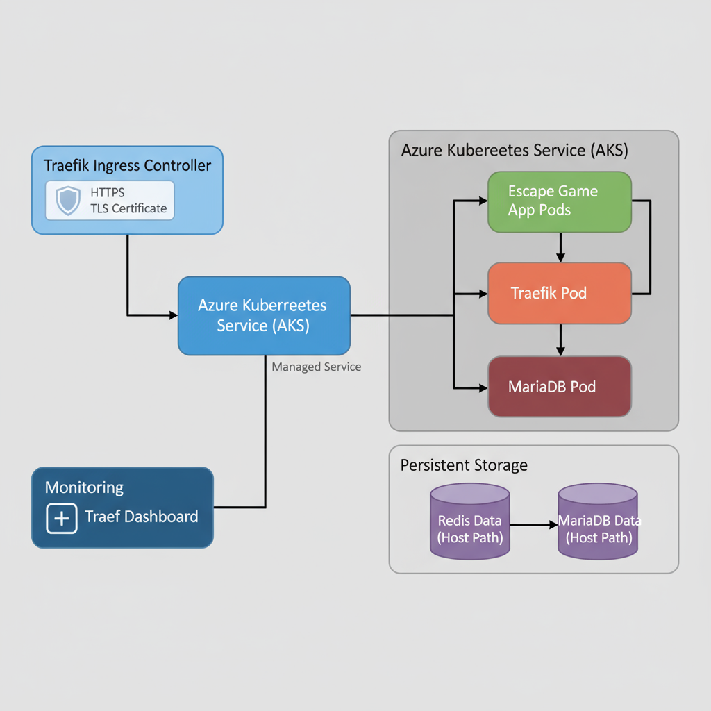

# Workshop M1 EISI 2025–2026 - Documentation

## ⚙️ Projet : **Cyber-Hôpital – Mission Résilience**

### 🎬 Concept général

Une cyberattaque a frappé un grand hôpital connecté.
Les dossiers médicaux des patients sont corrompus par un **virus informatique intelligent**.
Votre équipe (les joueurs) est une **unité spéciale de cybersécurité médicale** chargée de rétablir le système avant que les patients ne soient en danger.

🎯 **Objectif du jeu** :
Réparer les systèmes vitaux (4 salles virtuelles) en résolvant des énigmes liées à :

* la **cybersécurité médicale**,
* la **santé humaine (données, ADN, IRM, rythme cardiaque)**,
* la **collaboration et la logique**.

---

## 🧩 Structure du jeu (Escape game numérique)

| Salle                   | Nom                    | Enigme principale                                                                | Objectif pédagogique                                       |
| ----------------------- | ---------------------- | -------------------------------------------------------------------------------- | ---------------------------------------------------------- |
| **1. Salle du Serveur** | “Le pare-feu corrompu” | Décoder un mot de passe à partir d’un log chiffré (substitution, base64, etc.)   | Sensibiliser à la sécurité des données de santé            |
| **2. Laboratoire ADN**  | “Les gènes brouillés”  | Reconstituer une séquence ADN (mini puzzle logique)                              | Comprendre la logique de l’ADN et des données biomédicales |
| **3. Salle d’Imagerie** | “IRM fantôme”          | Reconstituer une image médicale corrompue (pixels manquants ou puzzle à glisser) | Découvrir le rôle de l’imagerie médicale                   |
| **4. Salle du Cœur**    | “Rythme vital”         | Mini-jeu basé sur la synchronisation : cliquer ou respirer au bon rythme         | Sensibiliser au stress et à la régulation cardiaque        |

Chaque énigme réussie **débloque une clé** pour restaurer une partie du système.
À la fin, un **débriefing** montre ce qu’ils ont appris (protection des données, santé, émotion, etc.).

---

## 🧑‍💻 Partie technique

**Technos recommandées :**

* **Front-end** : Vue.js (interface claire, chronomètre, navigation entre salles).
* **Back-end** : Node.js pour la logique serveur.
* **Communication multi-joueurs** : Firebase Realtime DB ou WebSocket simple.
* **Hébergement rapide** : Vercel ou Netlify.
* **Stockage / sauvegarde** : localStorage ou Firebase.
* **Stockage persistant** : Redis et MariaDB
* **Déploiement de l'app** : Image Docker déployée par cluster AKS
* **Connexion à l'aa** : url <https://escape.eisi-dune.eu>
* **Sécurité** : chiffrer les échanges simples (hash, base64, pas de vraies données personnelles).

Option bonus 💡 :
👉 connecter un **capteur cardiaque Arduino** (ou simulateur via micro) pour la salle du Cœur.
Exemple : si le joueur calme son rythme → LED verte, sinon rouge.

---

## 🎨 UX / UI

* Interface “terminal médical futuriste” (fond sombre, verts/bleus lumineux).
* Sons d’alerte, sirène, battement de cœur.
* Chronomètre visible (compte à rebours 20-30 minutes).
* Indices progressifs (chat intégré ou bouton “Help”).

---

## 🧠 Message éducatif final

À la fin du jeu, un **écran de débriefing** explique :

* Pourquoi la cybersécurité médicale est cruciale,
* Les dangers des fuites de données de santé,
* L’importance de la gestion du stress pour la performance cognitive.

---

## 🎤 Présentation orale (5 min)

Plan conseillé :

1. **Intro (en anglais)** : présentation de l’équipe + mission.
2. **Storytelling** : “Un hôpital attaqué, des patients en danger…”
3. **Démonstration** du jeu (montrer 2-3 salles).
4. **Apport pédagogique** : cybersécurité + santé mentale.
5. **Conclusion & originalité** : “Notre jeu sensibilise en rendant l’éducation médicale interactive.”

## Objectif du projet Infra

Mettre en place une infrastructure Kubernetes complète sur Azure (AKS) pour héberger une application web d’escape game développée par l’équipe Dev.

L’objectif est de permettre :

- un accès sécurisé via HTTPS (Let's Encrypt),
- la gestion du trafic via Traefik,
- la persistance des données (Redis + stockage local Kubernetes),
- l’utilisation d’une base de données MariaDB avec stockage local sur les nœuds Kubernetes (compte étudiant Azure gratuit ne supportant pas la persistance Azure Files CSI).

## Architecture globale

Architecture globale de l'infrastructure Escape Game déployée sur AKS, sécurisée via Traefik et TLS Let’s Encrypt.

Topologie détaillée comme suit :

                 ┌──────────────┐
                 │ Utilisateurs │
                 └──────┬───────┘
                        │ HTTPS
                 ┌──────▼───────┐
                 │  Traefik     │
                 │ Ingress Ctrl │
                 └──────┬───────┘
                        │
      ┌─────────────────┬───────────────┐
      │                 │               │
┌─────▼─────┐     ┌─────▼─────┐    ┌────▼────┐
│Escape App │     │ Redis Pod │    │MariaDB  │
│   Pods    │     │ (cache)   │    │ Pod     │
└───────────┘     └───────────┘    └─────────┘

Les utilisateurs accèdent via HTTPS vers Traefik qui fait l’équilibrage de charge.
Traefik distribue vers l’app Escape Game, le cache Redis, et la base MariaDB (avec stockage local).
La simplicité évite des détails sur le webhook ou certificats qui ne sont pas encore prêts.

Utilisateurs --> HTTPS --> Traefik Ingress Controller --> Application Escape Game Pods  
&emsp;&emsp;&emsp;&emsp;&emsp;&nbsp;---> Redis Pod (cache)  
&emsp;&emsp;&emsp;&emsp;&emsp;&nbsp;---> MariaDB Pod (stockage local K8s hostPath)  
&emsp;&emsp;&emsp;&emsp;&emsp;&nbsp;---> Traefik Dashboard (auth + whitelisting)  

## Fichiers du projet

Dans le dossier cluster-gandi :

- `deploy-infra1.sh` : Script principal déploiement infra  
- `deploy-infra2.sh` : Script version chart.yaml + values.yaml  
- `escape.yaml` : Déploiement app Escape Game + Redis + MariaDB  
- `ingress.yaml` : Configuration accès HTTPS  
- `issuer.yaml` : Configuration Let's Encrypt  
- `certif.yaml` : Certificat TLS Traefik  
- `traefik-config.yaml` : Configuration Traefik dashboard + auth + IP  
- `chart.yaml` et `values.yaml` : Helm chart webhook-gandi  

Dans le dossier cluster-acme :

- `deploy-infra1.sh` : Script principal déploiement infra 
- `escape.yaml` : Déploiement app Escape Game + Redis + MariaDB  
- `ingress.yaml` : Configuration accès HTTPS  
- `issuer.yaml` : Configuration Let's Encrypt + ACME
- `certif.yaml` : Certificat TLS Traefik  
- `traefik-config.yaml` : Configuration Traefik dashboard + auth + IP  

Dans infra directement :
- Scripts auxiliaires : Nettoyage et vérification infra  

## Documentation PAT Gandi

Le déploiement utilise un Personal Access Token (PAT) pour remplacer l’ancien token API déprécié de Gandi, suivant la documentation officielle Gandi :  
<https://docs.gandi.net/en/managing_an_organization/organizations/personal_access_token.html>

## Particularités techniques

- **Persistance MariaDB** :  
  Compte étudiant Azure gratuit interdit d’utiliser Azure Files CSI. Le stockage se fait via Kubernetes `hostPath` local (semi-persistant, pertes de données possibles si pods migrent).

- **Redis** :  
  Stockage `emptyDir` éphémère utilisé, adapté pour cache.

- **Autoscaling et monitoring** :  
  Limités sur compte gratuit Azure (addons non disponibles).

- **Image Docker multi-architecture** :  
  Construction multiarchi effectuée avec Builder Docker, image poussée sur Docker Hub.

- **Webhook Gandi** : la précédente versions pour l'API dépréciée ne supporte pas le PAT. En mettant à jour le webhook Gandi censé supporter le PAT l'image docker est non fonctionnelle (aucune version fonctionnelle trouvée) et le container du namespace cert-manager ne peut pas être créé, les certificats https qui en découlent non plus. Donc impossible de se connecter à l'application en https. 

## Étapes de déploiement

### Prérequis

- Compte Azure (étudiant ou autre)  
- Docker Hub avec l’image Docker multi-archi `produn/escape-workshop:latest`  
- Domaine Gandi configuré (`escape.eisi-dune.eu`, `traefik.eisi-dune.eu`)  
- Compte Azure Database for MariaDB (utilisé localement sur AKS via `hostPath`)

### Exécution

- Donner les droits :  

`
chmod +x infra_creation.sh
chmod +x infra_deploy2.sh
`

- Lancer le script voulu :  

`
./infra_creation.sh # Version simple sans helm chart local
./infra_deploy2.sh # Version avec Helm chart et values.yaml
`

## Vérifications post-déploiement

- `kubectl get pods -n default`  
- `kubectl get svc -n default`  
- `kubectl get ingress -n default`  
- `kubectl get certificate -A`  
- Accès application HTTPS : <https://escape.eisi-dune.eu>  
- Dashboard Traefik sécurisé : <https://traefik.eisi-dune.eu>

## Commandes utiles

- Logs app Escape Game :  

`kubectl logs -n default -l app=escape-app --tail=50`

- Accès shell pod :  
  
`kubectl exec -it -n default deploy/escape-app -- /bin/bash`

- Liste objets Kubernetes :  

`kubectl get all -n default`

- Nettoyage Azure :  

`az group delete -n workshop-EISI --yes --no-wait`
